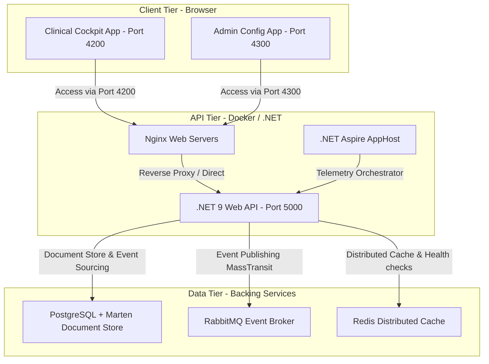

# CarePortal PAS - System Architecture Specification

This document details the architectural foundation, design patterns, and core technology decisions of the CarePortal Patient Administration System (PAS) stack.

---

## 🏛️ Core Technology Stack

The CarePortal architecture is divided into three primary tiers: the orchestrator defaults, the modular event-sourced APIs, and the standalone frontend micro-apps.



### 1. Backend API & Framework Services
* **.NET 9 (ASP.NET Core)**: Serves as the core runtime. Standardizes controller bindings, authorization logic, and REST communication.
* **.NET Aspire**: Coordinates local development execution, container bindings, and exports standardized health metrics and OpenTelemetry logs.
* **MassTransit + RabbitMQ**: Serves as the integration message bus, driving asynchronous event communication (e.g. publishing event registrations and admission details to downstream analytics or billing).

### 2. Database & Storage Architecture
* **PostgreSQL (v16)**: Selected as the primary ACID-compliant relational engine.
* **Marten (v7)**: Layered directly on top of PostgreSQL, utilizing its native high-performance `JSONB` columns. Marten serves as:
  * A **Document Database** for storing relational configurations (Wards, User Profiles, Role Access matrices) without complex ORM entity mappings.
  * An **Event Store** for tracking patient timelines (Admissions, Transfers, Discharges) chronologically to build audit trails.

### 3. Frontend Architecture
* **Angular 19 Standalone**: Decouples component compilation and removes legacy modules.
* **Zoneless Change Detection**: Configured using `provideExperimentalZonelessChangeDetection()`. Bypasses `zone.js` monkey-patching of browser APIs, eliminating CPU overhead.
* **Angular Signals**: Provides fine-grained reactivity, triggering targeted DOM updates when state values change.

---

## 🔄 Event Sourcing & CQRS Pattern

CarePortal utilizes Event Sourcing for the core Patient Demographics and ADT (Admission, Transfer, Discharge) aggregates.

### The Write Model (Event Store)
Whenever a clinical action occurs, it is saved as an immutable event in the PostgreSQL `mt_events` table under a dedicated patient event stream:
* `PatientRegisteredEvent`: Contains primary identifiers (NHS/CHI/IHI), DOB, and demographics.
* `PatientAdmittedEvent`: Appends ward details, admitting clinician, and infection warnings.
* `PatientTransferredEvent`: Appends movement records between wards and bed slots.
* `PatientDischargedEvent`: Appends discharge summaries and clinical coding data.

### The Read Model (Projections)
To query patient records efficiently, Marten maintains a compiled read snapshot projection. In `Program.cs`, we register an inline projection for the `Patient` document:

```csharp
options.Projections.Snapshot<Patient>(SnapshotLifecycle.Inline);
```

Whenever an event is appended to a patient's stream, Marten synchronously triggers a projection function that applies the event changes to a `Patient` record and writes it to the `mt_doc_patient` table. Queries (e.g., retrieving patients currently in the AMU ward for the Bed Board) are executed directly against this JSONB read table, ensuring sub-millisecond response times.

---

## ⚡ Zoneless Angular 19 Execution

Traditional Angular applications use `zone.js` to intercept asynchronous events (timers, mouse clicks, HTTP requests) and trigger full-page component tree change-detection cycles. On busy medical dashboards with multiple ticking timers (like the Emergency Department breach clock or waitlist paths), this causes constant repaint calculations.

In CarePortal, `zone.js` is entirely disabled:
1. **Bootstrapping**: Bootstrapped in [main.ts](file:///d:/Vignesh/PASApplication/frontend/pas-app/src/main.ts) using `provideExperimentalZonelessChangeDetection()`.
2. **Reactivity**: Signals (`signal`, `computed`, `effect`) bind directly to template bindings.
3. **Change Detection**: When a signal changes, Angular schedules a microtask to update only the DOM nodes referencing that specific signal.

---

## 🛡️ Micro-Frontend Architecture

To isolate clinical operations from system configuration, CarePortal segregates portals into two decoupled Angular applications:
1. **Clinical Portal (`frontend/pas-app`)**: Serves clinicians, ward managers, and trauma nurses.
2. **Admin Config Portal (`frontend/admin-config`)**: Serves system administrators configuring roles and ward parameters.

* **Origin-Based Integration**: The applications operate independently. However, the Admin micro-app reads JWT tokens stored in browser `localStorage` (`pas_auth_token`), enabling seamless single sign-on (SSO) if accessed from the same local client browser session.
