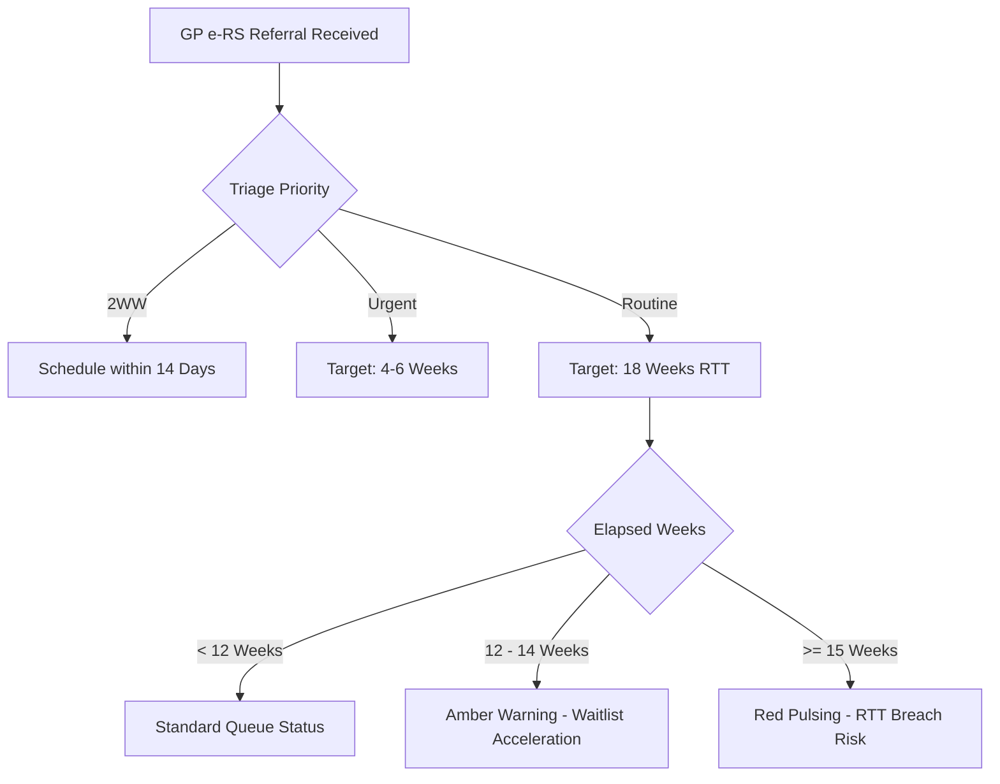
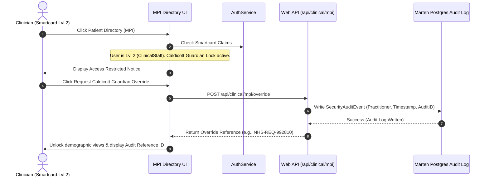

# CarePortal PAS - Functional Design Specification

This document details the functional capabilities, clinical design patterns, user personas, and regulatory workflows implemented within the CarePortal Patient Administration System (PAS) template.

---

## 👥 Clinical & Administrative User Personas

CarePortal is designed to support three core roles with distinct clinical and administrative responsibilities:

### 1. The Consultant Clinician (e.g., Dr. Fiona Gallagher)
* **Role**: `ClinicalStaff` (Smartcard Security Level 2)
* **Access Scope**: Read and write patient clinical charts, write consultation notes, triage waiting lists, review scheduled appointments, and manage ED triage categories.
* **Core Goal**: Maintain clinic output, ensure patient safety during outpatient/inpatient pathways, and record clinical documentation at the point of care.

### 2. The Ward Manager (e.g., Ward Manager Sean)
* **Role**: `WardManager` (Smartcard Security Level 3)
* **Access Scope**: Direct real-time bed board allocations, record inpatient admissions, transfer patients between beds or wards, trigger infection controls, and coordinate with clinical teams for discharges.
* **Core Goal**: Maximize ward occupancy efficiency, minimize transfer bottlenecks, and enforce isolation boundaries during infection outbreaks.

### 3. The System Administrator (e.g., SystemAdmin)
* **Role**: `SystemAdmin` (Smartcard Security Level 4 / Caldicott Guardian)
* **Access Scope**: System-wide configuration options, user account directories, ward capacity controls, Caldicott demographic directory overrides, and security role permission matrices.
* **Core Goal**: Maintain audit history integrity, register new practitioners, adjust ward bed allocations, and manage access parameters.

---

## ⏱️ Regulatory Clinical Pathways

CarePortal models the critical time-bound targets mandated by the UK National Health Service (NHS) and Irish Health Service Executive (HSE):

### 1. GP Referral-to-Treatment (RTT) Pathway (England & Wales)
* **Mandate**: The NHS constitutional target requires that at least **92%** of patients on non-urgent pathways start consultant-led treatment within **18 weeks** of their referral date.
* **Priority Tiers**:
  * **Routine**: Evaluated against the standard 18-week pathway.
  * **Urgent**: Prioritized with a shorter internal target (typically 4-6 weeks).
  * **Two-Week Wait (2WW)**: Suspected cancer referrals requiring urgent assessment within 14 days.
* **Visual Escalation Metrics**:
  * **$\ge 12$ Weeks**: Displays an **Amber warning** border indicating waitlist acceleration is required.
  * **$\ge 15$ Weeks**: Displays a pulsing red **`RTT BREACH RISK`** alert to flag immediate clinical schedule priority.

### 2. Emergency Department (ED) 4-Hour Treatment Target
* **Mandate**: Patients presenting at the Emergency Department must be triaged, treated, and either admitted, transferred, or discharged within **4 hours (240 minutes)** of check-in.
* **Manchester Triage System (MTS) Severity Levels**:
  * **Category 1 (Immediate)**: Resuscitation/Red (Card highlights in high-intensity red).
  * **Category 2 (Very Urgent)**: Orange (Card highlights in orange).
  * **Category 3 (Urgent)**: Yellow (Card highlights in yellow).
  * **Category 4 (Standard)**: Green.
  * **Category 5 (Non-Urgent)**: Blue.
* **Visual Escalation Metrics**:
  * **$\ge 180$ Minutes (3 hours)**: Card displays a **Yellow warning** outline.
  * **$\ge 240$ Minutes (4 hours)**: Card triggers a flashing red **`4-HOUR BREACH`** alert, signaling compliance escalation.

---

## 🛡️ Master Patient Index (MPI) & Caldicott Guardian Auditing

The Master Patient Index (MPI) acts as the central demographic database holding patient national numbers (NHS/CHI/IHI), home addresses, and phone directories. 

Under the **Caldicott Principles** (specifically Principle 1: *Justify the purpose*, and Principle 2: *Don't use patient-identifiable information unless absolutely necessary*), patient demographics are protected from generalized clinical views.

### Caldicott Guardian Override Workflow
1. **Access Lock**: Clinicians accessing the Patient Directory (`/mpi`) are greeted with a secure screen locking demographics data.
2. **Access Override Request**: If a clinician requires access (e.g. to confirm identity during a critical transfer), they can trigger an **Override**.
3. **Audit Log Generation**: The system logs a security audit record in Marten containing:
   * Override Reference ID (e.g., `NHS-REQ-882910`).
   * Authenticated Practitioner Smartcard User ID.
   * Timestamp.
   * Rationale for override.
4. **Data Decoupling**: The system grants temporary view access to the directory on the client browser while logging the action for compliance audits.

---

## 🏥 Real-Time Bed Board & Infection Control

The Bed Board provides a functional map of hospital wards, displaying beds, occupant details, and current capacity:

* **Visual Grid**: Displays wards (e.g., AMU, Ward A, ICU) with occupancy rates (e.g., `8/10 Beds Allocated`).
* **Bed Movement Operations**:
  * **Admission**: Allocates an incoming patient directly to an empty bed.
  * **Transfer**: Moves an active inpatient from one ward bed to another.
  * **Discharge**: Releases the bed, prompting the clinical discharge coding summary.
* **Infectious Isolation hotzones**:
  * Administrators can toggle **Infectious Isolation** on a ward.
  * The ward's bed board card instantly displays a flashing hazard banner, warning practitioners of strict isolation procedures.
