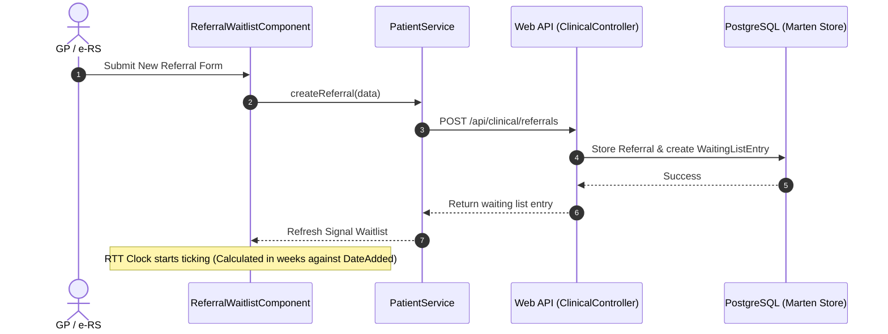

# CarePortal PAS - High-Level Design (HLD)

This document describes the high-level components, network communication, system interfaces, security mappings, and primary clinical data flows.

---

## 🌐 Network Topography & System Topography

The CarePortal architecture utilizes isolated Docker networks with exposed gateways to the client web browser:

```text
[Client Web Browser]
       │
       ├─── Port 4200 ───> [ pas-clinical-app ] (Nginx container serving Clinical Cockpit SPA)
       ├─── Port 4300 ───> [ pas-admin-app ]    (Nginx container serving Admin Console SPA)
       │
       └─── Port 5000 ───> [ pas-api ]          (C# ASP.NET Core container serving REST endpoints)
                              │
                              ├─── Port 5432 ───> [ pas-db ] (PostgreSQL container, Marten store)
                              ├─── Port 5672 ───> [ pas-rabbitmq ] (RabbitMQ container, AMQP)
                              └─── Port 6379 ───> [ pas-redis ] (Redis container)
```

### Component Interfaces
* **Frontend-to-Backend REST API**: All client requests (e.g. admitting a patient, registering a user) are communicated as asynchronous HTTP REST requests to the `pas-api` gateway on port `5000`.
* **Database Queries**: The C# backend queries the Postgres database directly on port `5432` using TCP connections.
* **Message Broker Publishing**: C# events are serialized and published over the AMQP protocol on port `5672` to RabbitMQ.

---

## 🔒 Security & Identity Federation (NHS CIS2 Integrated)

CarePortal implements role-based access control (RBAC) modeled after the NHS Care Identity Service 2 (CIS2) and Irish HSE security guidelines.

### 1. JWT Claims Matrix
Authentication issues a signed JSON Web Token (JWT) with the following claims:
* `unique_name`: The authenticated user's display name.
* `role`: The security role (`SystemAdmin`, `ClinicalStaff`, or `WardManager`).
* `nhs_user_id`: The national practitioner identifier (e.g., NHS smartcard ID `NHS-SC-883921`).
* `auth_method`: The authentication provider method (`CIS2_Smartcard` or `Password`).

### 2. Smartcard Authorization Levels
The application maps user scopes to credential levels (1–4):
* **Level 1 (Basic)**: View non-clinical data.
* **Level 2 (Standard - ClinicalStaff)**: Read and write clinical records, manage waitlists, and triage ED cases.
* **Level 3 (Specialist)**: Authorize transfers and write document coding (SNOMED).
* **Level 4 (Full/Caldicott Guardian - SystemAdmin)**: Manage users, access the National MPI patient directory, and configure ward schemas.

---

## 🔄 Core Clinical Data Flows

### 1. GP Referral-to-Treatment (RTT) Pathway
The RTT pathway ensures patient wait times are tracked against the standard **NHS 18-week treatment mandate**:



### 2. Clinic Booking Flow (Waitlist to Schedule)
When scheduling a patient from the active waitlist, the system transitions their state:
1. **Selection**: User clicks **Schedule Appointment** in the GP Referrals waitlist tab.
2. **State Sharing**: The Waitlist component sets the `activeSchedulingRequest` signal in `PatientService`.
3. **Tab Focus & Scroll**: The Clinical Cockpit shell detects the scheduling request, activates the **Booking Scheduler** tab, and scrolls smoothly to the Booking form.
4. **Pre-population**: The Booking Scheduler component reactively reads the scheduling request, pre-filling the patient's name, ID, and referral entry ID.
5. **Confirmation**: Clinician selects a date, location, and consultant, and clicks **Confirm & Book Slot**.
6. **Persistence**: A POST request is sent to `/api/clinical/bookings`. Marten:
   * Stores the new `Booking` document.
   * Updates the corresponding `WaitingListEntry` status from `Waiting` to `Scheduled` (removing it from the active waiting list).
   * Resets the `activeSchedulingRequest` signal to null.

### 3. Emergency Department (ED) Triage & Breach Clocks
The Emergency Care module tracks arriving casualties and monitors them against the **NHS 4-hour ED treatment limit**:
* **Arrival**: User logs an emergency arrival (POST `/api/clinical/emergency/attend`), setting the patient's status to `AwaitingTriage` with a timestamp.
* **Triage**: A nurse triage assessment (POST `/api/clinical/emergency/triage`) updates the patient's severity category (1-Immediate to 5-Non-Urgent).
* **Breach Clock**: A frontend timer calculates elapsed minutes (`currentTime - arrivalTime`).
  * If elapsed time $\ge 180$ minutes (3 hours): Card flashes a **yellow warning** boundary.
  * If elapsed time $\ge 240$ minutes (4 hours): Card flashes a red **`4-HOUR BREACH`** warning, prompting immediate escalation.
* **Discharge**: Discharging the patient removes them from the active triage monitor board.
